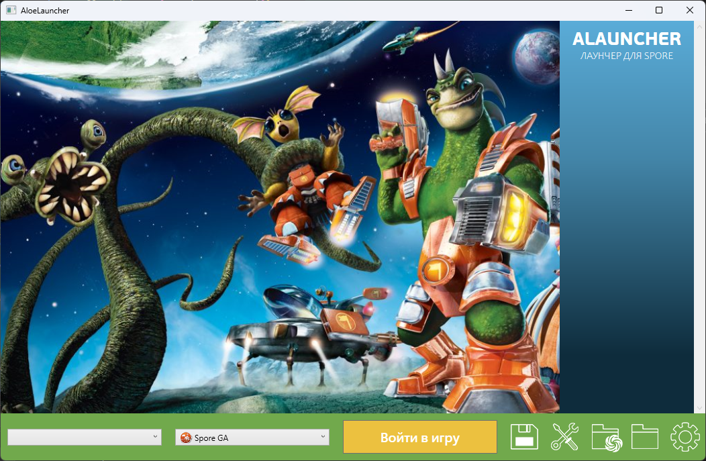

# ALauncher

Лаунчер для Spore, с помощью которого вы можете:
1. Переключаться между галактиками (сохранениями)
2. Легко устанавливать и удалять моды
3. В пару кликов менять язык игры
4. Запускать игру с аргументами командной строки
5. Быстро получать доступ к директориям игры и творений

---
## Необходимые компоненты

Для корректной работы требуется [Spore ModAPI Launcher Kit](http://davoonline.com/sporemodder/rob55rod/ModAPI/Public/index.html), а также последняя версия [.NET](https://dotnet.microsoft.com/en-us/download/dotnet/thank-you/runtime-desktop-7.0.10-windows-x64-installer?cid=getdotnetcore)